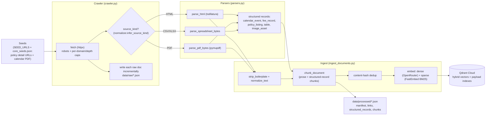
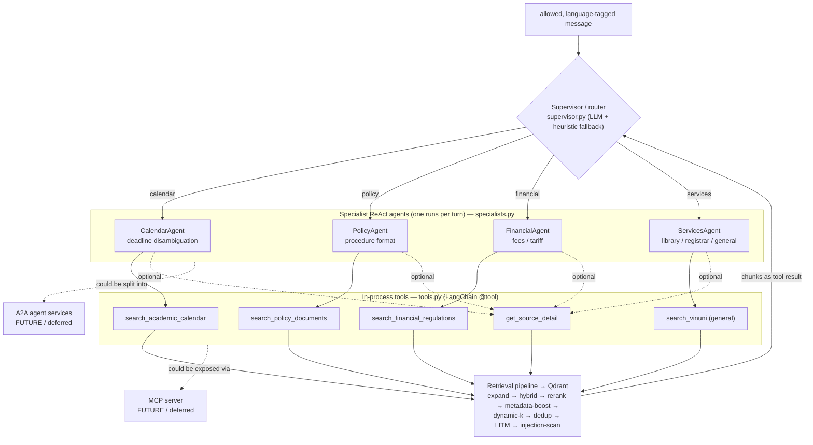
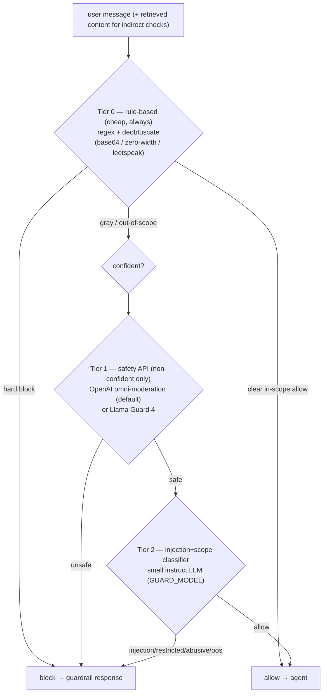

# VinChatbot — Architecture & Flow

Visual reference for how data and a chat turn move through the system. Diagrams are
Mermaid (render in GitHub and the VS Code Mermaid preview). Pairs with [PRD.md](PRD.md) /
[UPDATE_PLAN.md](UPDATE_PLAN.md).

> State (2026-06-14, post-Phase 1.4): the flows, multi-agent routing, layered guards, and module
> map below match the current code. The layered safety guard (OpenAI omni-moderation) is **live**,
> and the Phase 1.4 faithfulness output-gate fix is reflected in §2. Serving pipeline is **plain-text**
> (markdown OFF) on **`gpt-4o-mini`**; **parent-document retrieval is built but gated OFF**
> (`ENABLE_PARENT_DOC=false`), so it is not drawn here. See [PHASE1.4_LOG.md](LOGS/PHASE1.4_LOG.md).

---

## 1. Offline ingest pipeline (admin / scheduled — never at chat time)



## 2. Online query flow (a single `/chat` turn)

```mermaid
flowchart TD
    req["POST /chat<br/>{message, conversation_id, filters}"]
    guard_in{"Input guard<br/>(resolve_guardrail_decision)"}
    blocked["build_guardrail_response<br/>(injection / restricted / abusive / out-of-scope / greeting)"]
    lang["detect language<br/>(answer_language) → directive"]

    subgraph graph["Multi-agent graph (LangGraph, graph.py) — see §2a for detail"]
        sup["Supervisor (supervisor.py)<br/>route intent: calendar|policy|financial|services"]
        spec["Selected specialist (1 of 4)<br/>ReAct agent, own prompt + tool subset"]
    end

    subgraph retr["Retrieval (tool _search → QdrantHybridRetriever)"]
        expand["multi-query expand + RRF<br/>(query_engineering.py)"]
        hybrid["hybrid dense+sparse search (Qdrant)"]
        rerank["rerank (OpenRouter, fail-open)"]
        ddup["near-dup dedup"]
        boost["metadata boost<br/>(source_trust / term / policy_code)"]
        dynk["dynamic-k (score-ratio + min/max)"]
        litm["lost-in-the-middle reorder"]
        scan["indirect-injection scan (drop poisoned chunks)"]
    end

    answer["answer + citations + tool_trace"]
    guard_out{"Output checks (chat)<br/>secret-leak · citation/degrade · faithfulness"}
    degrade["graceful degradation<br/>(not enough official info)"]
    resp["ChatResponse<br/>answer, citations, confidence, needs_human_review"]
    mem[("LangGraph checkpointer<br/>per conversation_id (in-session memory)")]

    req --> guard_in
    guard_in -->|blocked| blocked
    guard_in -->|allowed| lang --> sup --> spec
    spec -->|tool call| expand --> hybrid --> rerank --> ddup --> boost --> dynk --> litm --> scan --> spec
    spec --> answer --> guard_out
    guard_out -->|leak| blocked
    guard_out -->|unsupported| degrade
    guard_out -->|ok| resp
    graph <--> mem
```

## 2a. Multi-agent: supervisor → specialists → tools (and where MCP/A2A would fit)

How the "multi-agent" actually works today: the supervisor (a cheap LLM intent classifier
with a keyword-heuristic fallback) routes each turn to **one of four specialist ReAct
agents**. Each specialist is its own `create_agent` instance with its **own system prompt
and a focused subset of tools**. Tools are **in-process Python functions** (`tools.py`,
LangChain `@tool`) — every tool ultimately calls the same retrieval pipeline. Memory is the
shared LangGraph checkpointer keyed by `conversation_id`.

> **MCP / A2A are NOT implemented (deferred).** The dashed boxes below show where they
> *would* attach if adopted later: MCP would expose the tools over the Model Context
> Protocol so external clients/agents could call them; A2A would split the specialists into
> independent agent services that talk over the agent-to-agent protocol. Today everything
> runs in one process.



## 3. Guard layering (cost-aware: cheap tier first)



## 4. Module map

| Area | Modules |
|------|---------|
| API | `app/main.py`, `app/api/routes_chat.py`, `app/api/routes_ingest.py` |
| Agents | `agents/graph.py`, `supervisor.py`, `specialists.py`, `prompts.py`, `tools.py`, `vinuni_agent.py` |
| Guards | `agents/guardrails.py` (regex/deobf/faithfulness), `agents/llm_guard.py` (injection/scope), `agents/safety_guard.py` (omni-moderation/Llama Guard) |
| RAG | `rag/retriever.py`, `rag/reranker.py`, `rag/context.py` (LITM/dedup/dynamic-k), `rag/query_engineering.py`, `rag/citations.py` |
| Ingest | `ingest/crawler.py`, `parsers.py`, `normalizer.py`, `chunker.py`, `indexer.py`, `assets.py`, `ocr.py` |
| Storage | `storage/qdrant_store.py`, `storage/vector_metadata.py` |
| LLM/embeddings | `llm/openrouter_chat.py`, `embeddings/openrouter_embeddings.py` |
| Eval | `scripts/run_eval.py`, `data/eval/golden/*.json` |
