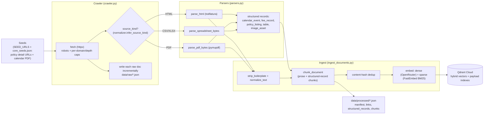
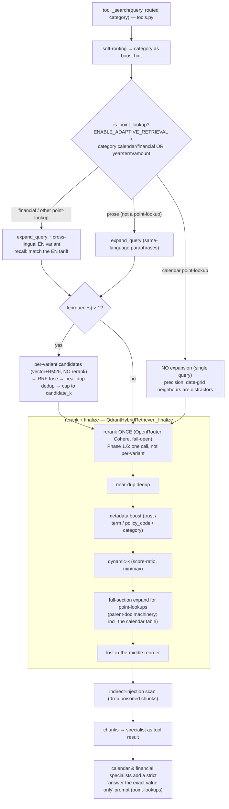
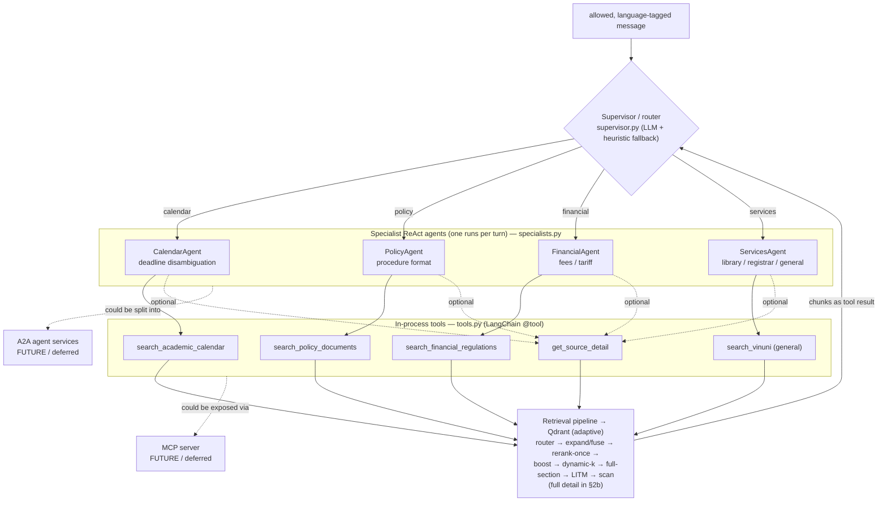
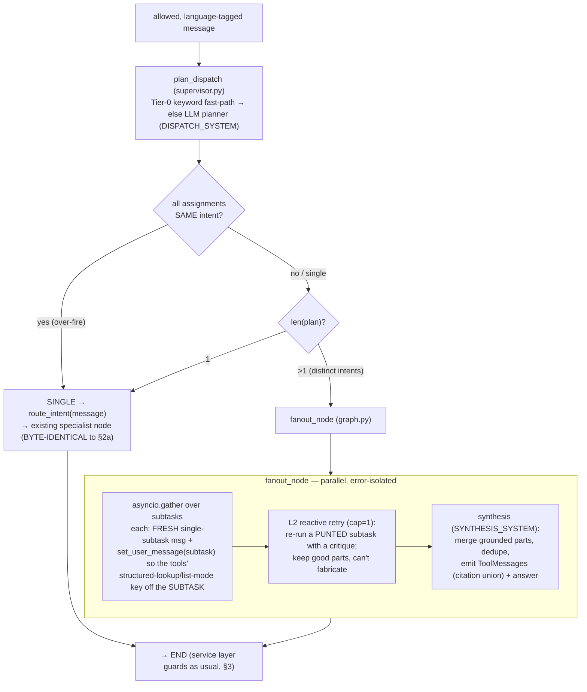
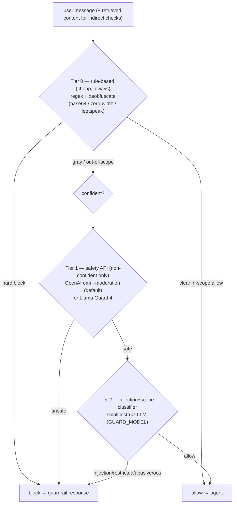

# VinChatbot — Architecture & Flow

Visual reference for how data and a chat turn move through the system. Diagrams are
Mermaid (render in GitHub and the VS Code Mermaid preview). Pairs with [PRD.md](PRD.md) /
[UPDATE_PLAN.md](UPDATE_PLAN.md).

> State (2026-06-26, post-Phase 1.33): the flows, multi-agent routing, layered guards, and module map
> below match the current code. Serving is **plain-text** on **`gpt-4o-mini`**. Major additions since
> Phase 1.7 (all `ENABLE_*`-flag-gated + fail-open; see [LOGS/SESSION_CLOSEOUT.md](LOGS/SESSION_CLOSEOUT.md)
> for the full done/deferred state and [UPDATE_PLAN.md](UPDATE_PLAN.md) for the roadmap):
> - **Multi-domain fan-out** (Phase 1.33, `ENABLE_FAN_OUT`, **PROMOTED → default ON**, the live flow): the
>   supervisor is a dispatch planner that DECOMPOSEs a genuine cross-domain compound into per-domain subtasks
>   run in PARALLEL, or HEDGEs a route-ambiguous question to 2 candidate specialists, then a synthesis node
>   merges (union of citations). A single-assignment plan (the ~87%) takes the single-specialist path,
>   byte-identical (defers to `route_intent`; same-intent over-fires collapse). Neutral on the single-domain
>   scored set (no regression after the over-fire fix) and adds the multi-domain coverage the single router
>   structurally can't. Set `ENABLE_FAN_OUT=false` to revert. See **§2c**.
> - **Deterministic structured lookup** (calendar + fee) runs BEFORE vector search — exact-row match for
>   point-lookups, **list mode** (Phase 1.27) returns the full fee matrix / all matching calendar events for
>   "all/each" questions (§2b). `ENABLE_STRUCTURED_LOOKUP`, `ENABLE_LIST_MODE`.
> - **Policy doc-pin + ingest auto-index** (Phase 1.21/1.24): a confidently-matched policy question pins its
>   canonical all-policies page by `source_url`; cross-lingual escalation forces the EN variant for VI policy
>   questions (`ENABLE_POLICY_DOC_PIN`, `ENABLE_POLICY_AUTO_INDEX`, `ENABLE_CROSSLINGUAL_POLICY`).
> - **Determinism + exact-match Redis cache** of LLM + rerank calls (Phase 1.23): reproducible runs + cheaper
>   re-runs, fail-open (`ENABLE_LLM_CACHE`, `ENABLE_RERANK_CACHE`).
> - **Output-guard unification** (Phase 1.25 Phase A): `resolve_output_decision` (secret-leak incl.
>   de-obfuscated/zero-width + citation/degrade + faithfulness), logged reasons (§3). The LLM output-audit
>   critic was rejected and is kept inert (`ENABLE_OUTPUT_AUDIT=false`).
> - Baseline: **≈0.98/199** golden, fan-out OFF ([data/eval/baseline.json](data/eval/baseline.json)); guards
>   1.000 (single-run noise ≈ ±3 cases).

---

## 1. Offline ingest pipeline (admin / scheduled — never at chat time)



## 2. Online query flow (a single `/chat` turn)

```mermaid
flowchart TD
    req["POST /chat<br/>{message, conversation_id, filters}"]
    guard_in{"Input guard<br/>(resolve_guardrail_decision)"}
    blocked["build_guardrail_response<br/>(injection / restricted / abusive / out-of-scope / greeting)"]
    lang["detect language<br/>(answer_language) → directive"]

    subgraph graph["Multi-agent graph (LangGraph, graph.py) — see §2a for detail"]
        sup["Supervisor / dispatch planner (supervisor.py)<br/>1 specialist (calendar|policy|financial|services),<br/>or fan-out to several (§2c)"]
        spec["Selected specialist(s)<br/>ReAct agent, own prompt + tool subset<br/>(parallel + synthesis when fanned out)"]
    end

    retr["Retrieval pipeline (adaptive)<br/>tool _search → QdrantHybridRetriever<br/>— full detail in §2b"]

    answer["answer + citations + tool_trace"]
    guard_out{"Output checks (chat)<br/>secret-leak · citation/degrade · faithfulness"}
    degrade["graceful degradation<br/>(not enough official info)"]
    resp["ChatResponse<br/>answer, citations, confidence, needs_human_review"]
    mem[("LangGraph checkpointer<br/>per conversation_id (in-session memory)")]

    req --> guard_in
    guard_in -->|blocked| blocked
    guard_in -->|allowed| lang --> sup --> spec
    spec -->|tool call| retr --> spec
    spec --> answer --> guard_out
    guard_out -->|leak| blocked
    guard_out -->|unsupported| degrade
    guard_out -->|ok| resp
    graph <--> mem
```

## 2b. Retrieval pipeline detail (adaptive — Phase 1.6 / 1.7)

Every tool call enters `_search` ([tools.py](../vinchatbot/app/agents/tools.py)). A cheap router
(`is_point_lookup`, [query_engineering.py](../vinchatbot/app/rag/query_engineering.py)) splits **prose**
from **point-lookups** (exact dates/amounts/codes — routed category `calendar`/`financial`, or a
year/term/amount in the query). Two shipped levers: **Phase 1.6** reranks the RRF-fused pool **once**
(not per variant — ~67% fewer rerank calls); **Phase 1.7** routes point-lookups to **full-section
reading + a strict extraction prompt**, with a domain split on query expansion (calendar OFF for
precision; financial ON + a cross-lingual English variant for recall). Toggles:
`ENABLE_RERANK_AFTER_FUSION`, `ENABLE_ADAPTIVE_RETRIEVAL` (both default **true**; set either `false`
to revert).

**Deterministic layers that run BEFORE / around vector search** (added Phase 1.19–1.27, each flag-gated +
fail-open → any miss falls through to the vector path byte-identically):
- **Structured lookup** ([structured_lookup.py](../vinchatbot/app/rag/structured_lookup.py)) — for
  calendar/financial turns, a pure dict/regex record match on the USER's raw question returns the ONE exact
  row (date/fee) — never the adjacent near-row vector leaks. **List mode** (Phase 1.27, `is_list_lookup` +
  `ENABLE_LIST_MODE`): "all/each/compare" questions return the **full fee matrix** (`_match_fee`) or **all
  matching calendar events** (`_match_calendar`) deterministically, and widen the vector path
  (`RETRIEVAL_LIST_MAX_K`) + enumerate. Built by `scripts/build_structured_index.py` →
  `data/processed/structured_records.json`.
- **Policy doc-pin** ([policy_lookup.py](vinchatbot/app/rag/policy_lookup.py)) — a confident single-topic
  policy match pins that canonical all-policies page by `source_url` (gap-proof doc selection). The curated
  17-topic map (precedence) + an **ingest auto-index** (title fallback for the other ~138 pages, built by
  `scripts/build_policy_topic_index.py`). VI policy questions also force an EN translation variant
  (cross-lingual escalation) so the often-EN canonical doc is RRF-fused in.
- **Exact-match cache** ([cache.py](../vinchatbot/app/core/cache.py)) — LLM responses (via
  `langchain` `set_llm_cache`) + rerank scores, keyed on the full prompt/content + `CACHE_VERSION`, in Redis.
  Reproducible runs (kills run-to-run noise on exact repeats) + cost cuts; fail-open (any Redis error → miss).



## 2a. Multi-agent: supervisor → specialists → tools (and where MCP/A2A would fit)

How the "multi-agent" actually works today: the supervisor is a **dispatch planner**
(`ENABLE_FAN_OUT` default ON — **§2c**) that routes a clear single-domain question to **one of
four specialist ReAct agents** (the ~87% common case shown below) or fans a genuine compound
out to several in parallel. Each specialist is its own `create_agent` instance with its **own
system prompt and a focused subset of tools**. Tools are **in-process Python functions** (`tools.py`,
LangChain `@tool`) — every tool ultimately calls the same retrieval pipeline. Memory is the
shared LangGraph checkpointer keyed by `conversation_id`.

> **MCP / A2A are NOT implemented (deferred).** The dashed boxes below show where they
> *would* attach if adopted later: MCP would expose the tools over the Model Context
> Protocol so external clients/agents could call them; A2A would split the specialists into
> independent agent services that talk over the agent-to-agent protocol. Today everything
> runs in one process.



## 2c. Multi-domain fan-out (Phase 1.33 — `ENABLE_FAN_OUT`, PROMOTED, default ON)

**The live flow.** It solves two single-route failures the old flow gets *categorically* wrong: **(a) compound
coverage** ("MD tuition **and** when does Fall start?" — single routing answers one half, silently drops the
other) and **(b) route ambiguity** (a boundary question mis-routed to the wrong single specialist). It is
**neutral on the single-domain scored set** (no regression after the same-intent over-fire fix) and adds the
multi-domain coverage that shows on the authored hard set `data/eval/golden_targets/`. Set `ENABLE_FAN_OUT=false`
to revert to plain single-specialist routing (§2a).

The supervisor calls the **dispatch planner** ([`plan_dispatch`, supervisor.py](vinchatbot/app/agents/supervisor.py))
instead of `route_intent`; the planner emits a PLAN = `list[{query,intent}]` in three modes:



Key engineering (each a measured fix, see [LOGS/PHASE1.33_LOG.md](LOGS/PHASE1.33_LOG.md)):
- **SINGLE is byte-identical**: a single-assignment plan defers to `route_intent` — the planner only decides
  single-vs-many, never the single-domain intent (letting it pick regressed scored cases).
- **Same-intent collapse**: a multi-assignment plan whose parts ALL route to one specialist is an over-fire →
  collapsed to SINGLE (one specialist answers all facets better from the whole-question context). Genuine
  DECOMPOSE/HEDGE always span ≥2 DISTINCT intents, so they still fan out.
- **Contextvar per subtask**: the turn pins `get_user_message()` to the whole compound; each subtask resets it
  to its own query (isolated per asyncio task) so the deterministic lookups don't key off the wrong text.
- **Synthesis emits the subtasks' ToolMessages** so the service-layer citation/faithfulness guards (§3) work on
  the **union** with no change; the audit is scoped to groundedness-only for a fused multi-domain answer.

## 3. Guard layering (cost-aware: cheap tier first)



The above is the **input** guard (`resolve_guardrail_decision`). The **output** guard
(`resolve_output_decision`, Phase 1.25/A4, always-on) runs on the generated answer in `vinuni_agent.chat`:
(1) **sensitive-output / secret-leak** — markers + key/token patterns, scanned on the raw **and**
de-obfuscated/zero-width-stripped answer; (2) **graceful-degradation** when there are no citations or an
"unknown-answer" marker; (3) **faithfulness** — numeric/date/year grounding against the retrieved evidence.
Each returns a logged `OutputAuditDecision(action, reason)`; the bypass paths (time fast-path, conversational)
get the secret scan too. The **LLM output-audit critic** (`output_audit.py`, `ENABLE_OUTPUT_AUDIT`) is wired
but **rejected/off** (over-degraded correct answers) — kept for a future security use.

## 4. Module map

| Area | Modules |
|------|---------|
| API | `app/main.py`, `app/api/routes_chat.py`, `app/api/routes_ingest.py` |
| Agents | `agents/graph.py` (graph + `fanout_node`, default ON), `supervisor.py` (`route_intent` + `plan_dispatch` fan-out planner), `specialists.py`, `prompts.py` (incl. `DISPATCH_SYSTEM`/`SYNTHESIS_SYSTEM`), `tools.py`, `vinuni_agent.py`, `agents/output_audit.py` (critic, gated off) |
| Guards | `agents/guardrails.py` (input `resolve_guardrail_decision` + output `resolve_output_decision`: regex/deobf/secret/faithfulness), `agents/llm_guard.py` (injection/scope), `agents/safety_guard.py` (omni-moderation/Llama Guard) |
| RAG | `rag/retriever.py`, `rag/reranker.py`, `rag/context.py` (LITM/dedup/dynamic-k), `rag/query_engineering.py` (`is_point_lookup`/`is_list_lookup`), `rag/structured_lookup.py` (calendar+fee deterministic + list mode), `rag/policy_lookup.py` (doc-pin + auto-index), `rag/citations.py` |
| Core | `core/config.py` (all `ENABLE_*` flags), `core/cache.py` (Redis LLM+rerank cache), `core/observability.py` (per-stage ledger) |
| Ingest | `ingest/crawler.py`, `parsers.py`, `normalizer.py`, `chunker.py`, `indexer.py`, `assets.py`, `ocr.py` |
| Storage | `storage/qdrant_store.py`, `storage/vector_metadata.py` |
| LLM/embeddings | `llm/openrouter_chat.py`, `embeddings/openrouter_embeddings.py` |
| Eval | `scripts/run_eval.py` (`--runs N`, ledger, confidently-wrong), `data/eval/golden/*.json`, `data/eval/baseline.json` |
| Index build | `scripts/build_structured_index.py` (calendar+fee records), `scripts/build_policy_topic_index.py` (policy auto-index) |
